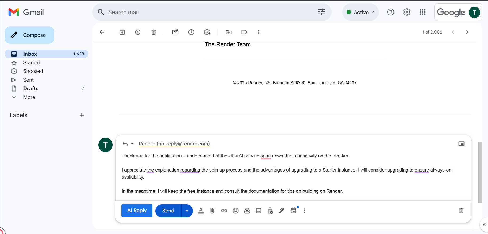
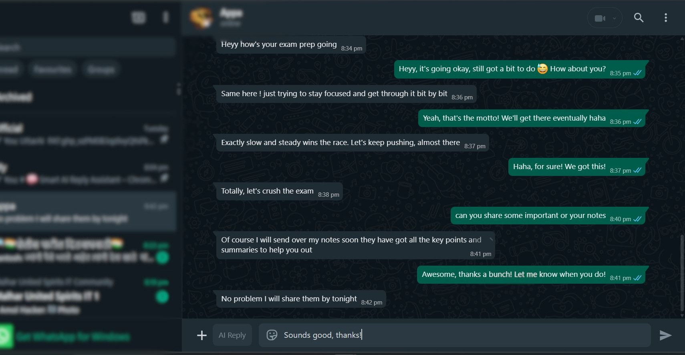
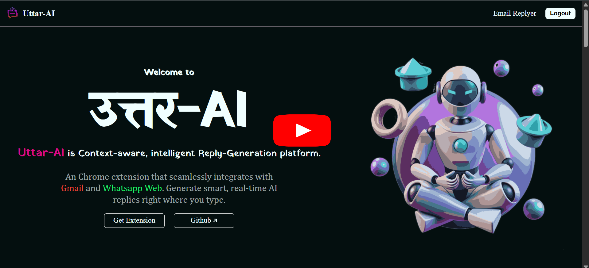

# 🧠 Smart AI Reply Assistant – Chrome Extension

🚀 **Boost your productivity in Gmail and WhatsApp** with this Chrome extension that generates **AI-powered smart replies** in real-time. Designed to understand context and deliver fluent, relevant responses at the click of a button.

---

## ✨ Features

- 💬 Captures full conversation context from Gmail and WhatsApp web
- 🤖 Sends the context to an **AI backend (Spring Boot)** for smart reply generation
- ✍️ Automatically inserts the reply into the input box – **no copy-pasting**
- ⚡ Saves time and ensures professional, consistent communication

---

## 📸 Screenshots

  
  

> *Left: Smart reply in Gmail | Right: Smart reply in WhatsApp Web*

---

## 🛠️ Tech Stack

**Frontend (Chrome Extension)**  
- JavaScript, HTML, CSS  
- DOM manipulation and Chrome Extension APIs  

**Backend (AI Reply Engine)**  
- Spring Boot (Java)
- REST API for communication
- AI model

---

<h2 align="center"> Project Demonstration</h2>

  

---
