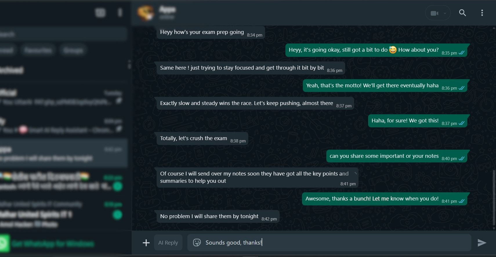
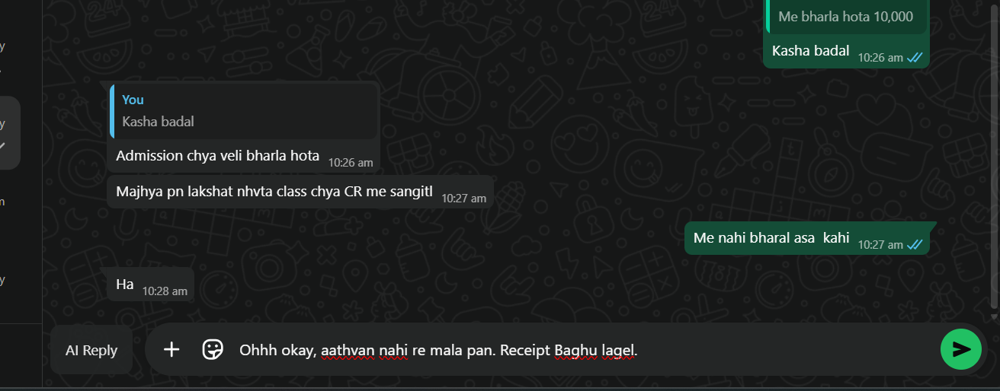
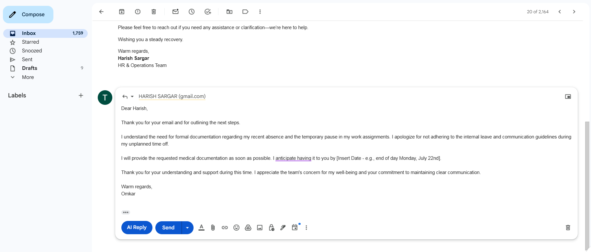
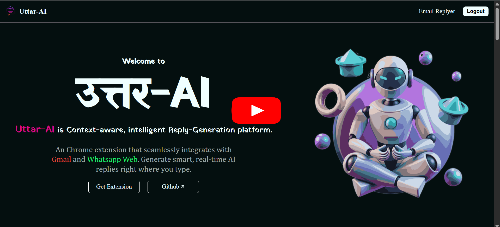
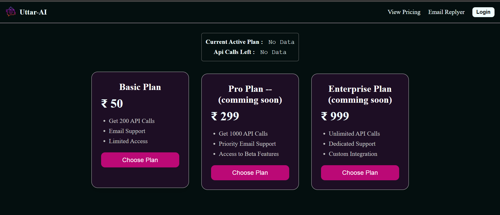
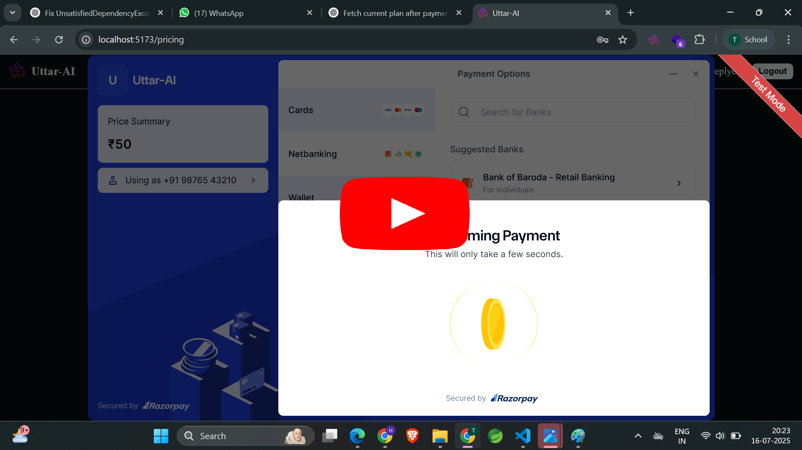

# 🧠 UttarAI – Chrome Extension

**UttarAI** is a Chrome Extension that provides smart, AI-generated replies for **Gmail** and **WhatsApp Web**. By capturing conversation context and leveraging a Spring Boot-powered backend, UttarAI automatically suggests personalized replies directly in the input box-saving time and improving communication efficiency.

---

## 📘 Introduction

**UttarAI** is a smart Chrome extension that integrates AI-powered reply suggestions into communication platforms like **Gmail** and **WhatsApp Web**. It utilizes DOM observation and context processing to automate personalized reply generation using an AI backend.

---

## ⚙️ Core Functionality

### a. Manifest Configuration (`manifest.json`)

Defines metadata and permissions for the extension:

- **Permissions**:  
  `storage`, `activeTab`, `tabs`, etc.

- **host_permissions**:  
  Allows access to specified URLs (e.g., WhatsApp Web, Gmail).

- **content_scripts**:  
  Injects JavaScript files into matching web pages.

- **web_accessible_resources**:  
  Securely injects or references scripts and styles.

---

### b. WhatsApp Integration (`content.js`)

#### 📌 DOM Observer

- Uses `MutationObserver` to detect DOM changes.
- Identifies when a new chat is opened by checking for input field rendering.
- Class names for elements are identified using Chrome DevTools.

#### ✨ Injecting the AI-Reply Button

- Checks for duplicates and removes existing buttons.
- Identifies and stores toolbar element (input area).
- Calls `createButton()` to insert a custom AI button that matches WhatsApp's theme.

<h2 align="center">Whatsapp Working</h2>
<table align="center">
  <tr>
    <td>
      
    </td>
    <td>
      
    </td>
  </tr>
</table>

#### 🧠 Generating Conversation Context

- Captures the **last 10 messages** from the DOM using `querySelectorAll()`.
- Tags messages with `me:` or `them:` to indicate the sender.
- On button click:
  - Sends the context to the Spring Boot backend API.
  - Receives the AI-generated response.
  - Injects it into the WhatsApp input box for user review/editing.

---

### c. Gmail Integration

<h2 align="center">Gmail Working</h2>
<table align="center">
  <tr>
    <td>
      
    </td>
    <td>
      
    </td>
  </tr>
</table>

- Similar to WhatsApp, but only the **current email content** is captured.
- Sends this to the backend for response generation.
- Injects the generated reply into Gmail's reply area.

---
<h2 align="center"> Project Demonstration</h2>

  

---

## 💳 3. Razorpay Payment Gateway Integration

### a. Setup

- Create a Razorpay account.
- Obtain **API Key** and **Secret Key**.

### b. Frontend Integration

- Displays **View Pricing** section with available plans.
- On plan selection, sends selected plan details to the backend API.

<h2 align="center"> View Pricing</h2>

    

### c. Backend Workflow

- Fetches plan details from the database.
- Uses `RazorpayClient` (configured in `pom.xml`) to:
  - Create an order (amount, receipt ID, etc.)
  - Return `orderId`, user info, and key details to frontend.

### d. Frontend Payment Flow

- Razorpay script is embedded in `index.html`.
- `Razorpay.Options` object is configured and invoked.
- Razorpay pop-up is triggered for payment.

 <h2 align="center">Razorpay Pop-up</h2>

    

### e. Handling Payment Responses

- Razorpay provides success and failure **callbacks**.
- On **success**, returns `paymentId`, `orderId`, and `signature`.
- On **failure**, displays an error message.

### f. Verifying the Payment

- Frontend sends `paymentId`, `orderId`, and `signature` to backend.
- Backend uses Razorpay's `Utils` class to verify the payment.
- If verification is successful:
  - Database is updated.
  - API call quota is increased based on the purchased plan.
- If verification fails:
  - Marks transaction as failed.

---

<h2 align="center"> Payment Gateway Integration</h2>

  

---
## 🔄 4. System Workflow Overview

### a. User Registration

- Users register via the website.
- Backend creates user account with:
  - Plan: `Free Tier`
  - API Calls: `25` (initial quota)

### b. Extension Installation & Login

1. User installs the Chrome extension.
2. Clicks on the extension icon → Login pop-up opens.
3. On login:
   - A new tab with a login form opens.
   - After successful login:
     - Tab closes
     - WhatsApp Web opens automatically.

### c. Chat Interaction

- When WhatsApp is open:
  - The **AI-Reply** button appears next to the input field.
  - On click:
    - Last 10 messages are collected.
    - API call is made to generate response.
    - AI-generated text is injected into the input field.

### d. Token Handling

- Uses **JWT** for session management.
- If the token expires:
  - Shows alert: `"Token expired. Please log in again."`

### e. API Call Limit Handling

- Free tier includes **25 API calls**.
- On exceeding the limit:
  - Shows alert: `"API call limit reached. Please upgrade your plan."`

### f. Plan Upgrade Process

1. Navigate to **View Pricing** on the website.
2. Choose a subscription plan.
3. Complete the payment via Razorpay (Test Mode).
4. On success:
   - API quota is updated.
   - Plan is updated in user profile.

### g. View Current Plan Details

- Users can view:
  - Current Plan
  - Remaining API Calls

---

## 🧪 Test Mode Note

> ⚠️ **All payments are currently in test mode.**  
> No real money is involved.  
> You can complete the entire payment process using **dummy/test credentials**.  
> Your API call quota will be updated based on the selected plan.

---

## 🛠 Tech Stack

| Component       | Technology                     |
|----------------|---------------------------------|
| **Frontend**    | Chrome Extension (JavaScript, HTML, CSS) |
| **Backend**     | Spring Boot (Java, Maven)       |
| **Payments**    | Razorpay API                    |
| **Authentication** | JWT Token-Based             |
| **Database**    | MySQL                           |

---

## 👤 Author

**Harish Sargar**  
> • [LinkedIn](https://www.linkedin.com/in/harish-sargar-09500124b/)

---

## 🌐 Live Deployment

The **UttarAI** project is deployed and available for use!

👉 **Try it out here**: [Uttar-AI Live Project](https://uttar-ai.vercel.app/)

